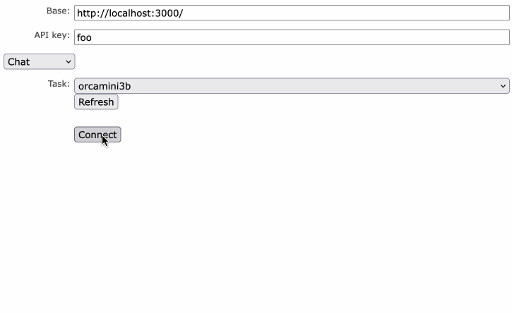
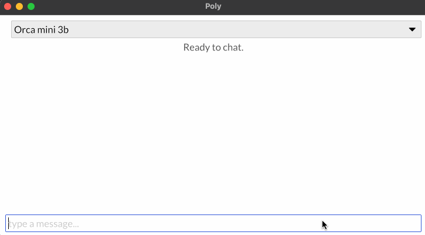

# Poly

Poly is a versatile LLM serving back-end. What it offers:

- High-performance, efficient and reliable serving of multiple local LLM models
- Optional GPU acceleration through either CUDA or Metal
- Configurable LLM completion tasks (prompts, recall, stop tokens, etc.)
- Streaming completion responses through HTTP SSE, chat using WebSockets
- Biased sampling of completion output using JSON schema
- Memory retrieval using vector databases (either built-in file based, or external such as Qdrant)
- Accepts and automatically chunks PDF and DOCX files for storage to memory
- API secured using either static API keys or JWT tokens

Nice extras:

- A web client to easily test and fine-tune configuration
- A single-binary cross platform desktop client for locally running models

Supported models include:

- LLaMa and derivatives (Alpaca, Vicuna, Guanaco, etc.)
- RedPajamas
- MPT
- Orca-mini

See [config.example.toml](./config.example.toml) for example configurations.

## Concepts

In Poly, _models_ are LLM models that support basic text generation and embedding operations. Models can be run on the GPU and have specific context lengths, but are otherwise unconfigurable.

A _task_ uses a model in a specific way (i.e. using specific prompts, stop tokens, sampling, et cetera. Tasks are highly configurable. A model may be shared by multiple tasks.

A _memory_ is a database that stores _chunks_ of text, and allows retrieval of such chunks using vector similarity (where each chunk has a vector calculated as an embedding from an LLM). Memories can be re-used between tasks.

```mermaid
classDiagram
    class Model {
        String name
        Boolean use_gpu
        Int context_length
    }
    class Task {
        String name
        String prompts
        Inference parameters
    }
    class Memory {
        String name
        Chunking parameters
    }
    class Chunk {
        String text
        Vector embedding
    }

    Task "*" --> "1" Model: Generation model
    Task "*" --> "1" Memory
    Memory "*"--> "1" Model: Embedding model
    Memory "1" --> "*" Chunk: Stored chunks
```

The API exposes models, tasks and memories by their name (which is unique within their category).

### Tasks

A task configures the way user input is transformed before it is fed to an LLM and the way the LLM output is transformed before it is returned to the user, in order to perform a specific task. A task can be configured to use (optional) `prelude`, `prefix` and `postfix` prompts. The prelude is fed once to the model for each session. The prefix and postfix are applied to each user input (i.e. each chat message):

```mermaid
sequenceDiagram
    actor User
    Task->>LLM: Prelude
    loop
        User->>+Task: Prompt
		alt When recall is enabled
			Task->>LLM: Recalled memory items (based on user prompt)
		end
        Task->>+LLM: Prefix
        Task->>LLM: Prompt
        Task->>LLM: Postfix

        note over LLM: Generate until stop token occurs or token/context limit reached
        LLM->>-Task: Response
        Task->>-User: Completion
    end
```

When biasing is enabled, an optional `bias prompt` can be configured. When configured the model will be asked to generate a response (following the flow as shown above). This response is however not directly returned to the user. Instead, the bias prompt is then fed, after which the biaser is enabled (and the biased response is returned to the user).

```mermaid
sequenceDiagram
    actor User
    Task->>LLM: Prelude
    loop
        User->>+Task: Prompt
		alt When recall is enabled
			Task->>LLM: Recalled memory items (based on user prompt)
		end
        Task->>+LLM: Prefix
        Task->>LLM: Prompt
        Task->>LLM: Postfix

        note over LLM: Generate until stop token occurs or token/context limit reached
        Task->>LLM: Bias prompt
        note over LLM: Generate with biaser enabled

        LLM->>-Task: Response (biased)
        Task->>-User: Completion
    end
```

## Architecture

Poly is divided into separate crates that can be used independently:

- [poly-server](./poly-server): Serve LLMs through HTTP and WebSocket APIs (provides `llmd`)
- [poly-backend](./poly-backend): Back-end implementation of LLM tasks
- [poly-extract](./poly-extract): Crate for extracting plaintext from various document types
- [poly-bias](./poly-bias): Crate for biasing LLM output to e.g. JSON following a schema
- [poly-ui](./poly-ui): Simple desktop UI for local LLMs

Applications looking to integrate Poly's capabilities should depend on `poly-backend`.

```mermaid
flowchart TD

subgraph Poly
	PW[poly web-client]
	PS[poly-server]
	PB[poly-backend]
	PE[poly-extract]
	PU[poly-ui]
	PBs[poly-bias]

	PW-->|HTTP,WS,SSE|PS
	PB-->PBs
	PS<-.->PE

	PS-->PB
	PU-->PB
end

LLM[rustformers/llm]
PBs<-.->LLM
PB<-.->Qdrant

T[tokenizers]
GGML
Metal
PB-->LLM
LLM<-.->T
LLM-->GGML
GGML-->Metal
GGML-->CUDA

```

## Authors

- Tommy van der Vorst (vandervorst@dialogic.nl)
